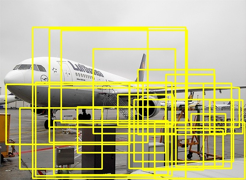
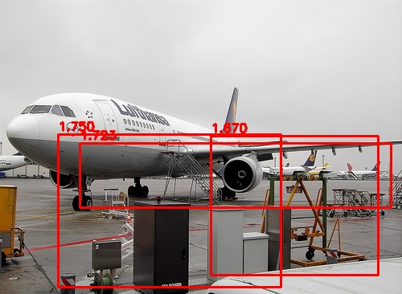

# Objectness Estimation: Finding "What is an Object?"

This project implements a comprehensive "Objectness" measure—a scoring system that predicts how likely a specific image window contains an object of any class. Inspired by the seminal paper *"What is an object?" (Alexe et al., CVPR 2010)*, this pipeline combines multi-scale spectral residuals, superpixel segmentation, and edge distribution to rank potential bounding boxes.

## Dataset & Framework

The parameters for these cues (Thresholds, Scales, and Thetas) were optimized and validated using the **Pascal VOC 2007/2012** dataset. By comparing candidate windows against ground-truth annotations using **Intersection over Union (IoU)**, the system maximizes the separation between object and background distributions.

## Scoring Cues

To determine the "Objectness" score, this pipeline integrates three fundamental visual cues:

1. **Multi-scale Saliency (MS):** Identifies pixels that stand out from the background using **Spectral Residuals** in the frequency domain (FFT).
2. **Straddling Superpixels (SS):** Employs the **Felzenszwalb algorithm** to penalize windows that "cut through" superpixels, favoring boxes that tightly contain complete segments.
3. **Edge Density (ED):** Uses a custom **Canny Edge Detector** to measure the concentration of edges near the inner boundary (ring) of a window.

## Mathematical Foundation

### Multi-scale Saliency (MS)

The image is transformed into the Fourier domain to calculate the Spectral Residual ():  

$$\huge R(f) = \log(A(f)) - \text{avg}(\log(A(f)))$$

Where  is the amplitude spectrum. The saliency map is the inverse transform of this residual.

### Straddling Superpixels (SS)

The score represents the fraction of a window's area not straddled by external superpixel components:  

$$\huge SS(w) = 1 - \frac{\sum_{s} \min(\text{area}(s_{in}), \text{area}(s_{out}))}{\text{area}(w)}$$

## 📂 Project Structure

| File | Responsibility |
| --- | --- |
| **main.py** | Orchestrates window sampling, cue scoring, and final visualization. |
| **cues.py** | Core implementation of the MS, SS, and ED scoring algorithms. |
| **learn_*.py** | Optimization suite for tuning hyperparameters against Pascal VOC annotations. |
| **utils.py** | High-performance utilities for **Integral Images** and XML parsing. |
| **canny_utils.py** | Manual implementation of Canny Edge Detection (NMS, Hysteresis). |

## Optimization: The Integral Image

To handle thousands of windows per image efficiently, this project utilizes **Integral Images (Summed Area Tables)**. This allows the system to calculate the sum of any cue (edges, saliency, or mask) in ** constant time**, regardless of window size.

## Visualizing Results

<h2 align="center"><b>Objectness Detection Results</b></h2>

<p align="center">
  <table>
    <tr>
      <td align="center"><b>Top 20 Proposals (Yellow)</b></td>
      <td align="center"><b>Top 3 Candidates (Red)</b></td>
    </tr>
    <tr>
      <td></td>
      <td></td>
    </tr>
  </table>
</p>

<p align="center">
  <i>The left image shows the broad proposals with a score threshold > 0.3. The right image shows the final top-ranked object windows filtered by the combined MS, SS, and ED cues.</i>
</p>


## Usage

### Training / Parameter Learning

```bash
python learn_ms_param.py
python learn_ss_param.py
python learn_ed_param.py

```

### Running Inference

```bash
python main.py --input ./data/test_images/ --output ./results/

```

## 💡 Motive

This project was developed for educational purposes to understand the "math under the hood." While libraries like OpenCV offer optimized versions of these functions, the algorithms here are implemented in Python/NumPy to demonstrate a deep understanding of the underlying theory.

